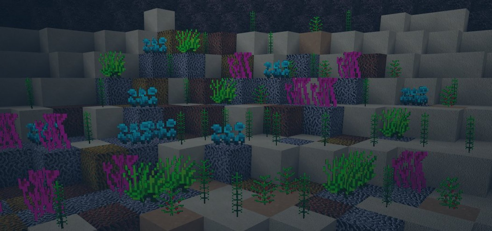
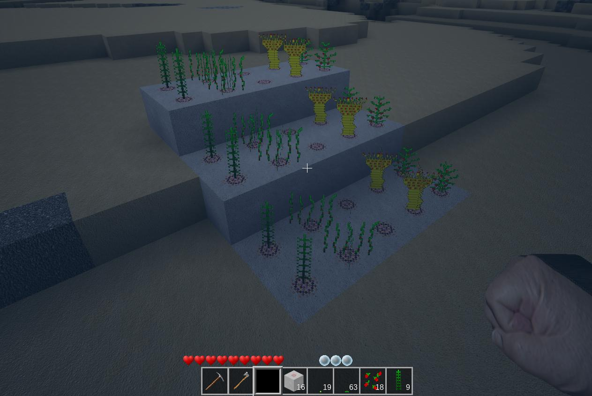

# Aqua Farming
A mod for minetest to farm under water.

## Description

Under water is sometimes a little boring. Granted, since minetest 5.x at least corals have been added, but how would it be to have a whole garden under water that you can even plant yourself?

This mod gives you the possibility to plant and harvest even under water. The special thing about it is that these plants also only thrive under water.

Now you can create your own garden under water. The plants drops now itself as item and seed's. With this seeds you plant new plants under water. But the plants needs a special substrate: water_soil. So for the first you have to craft water_soil.

## Sea alga

The sea alga is a simple plant, which you can find next to coralreefs. The plant likes warm water, so you can find it only in Desert-, Savana- or Rainforestoceans.
The plant is eatable.

## Sea strawberry

The sea strawberry is a plant, which prefers warm and nutrient-rich soil. So you can find it like the Sea alga at coral-reefs. 
The fruits of the sea strawberry are delicious.

## Sea grass

Sea grass is like kelp and you can find it everywhere. It grows often next to kelp. Sea grass isn't eatable in it's raw state, but maybe you find some recipes
for this grass. It' decorative. I heard it rumble, that the sea grass is used to extract salt and green dye, when you roast it. 

## Sea anemone

The Sea anemone is a carnivorus seaplant. It grows on on barren ground and in cold water, so the plant must obtain its nutrients in a different way. It 'eats' plankton, very small crabs and small water insects. The plant itself is eatable and some people say that the plant has an healing effect.

## Sea Cucumber

The Sea cucumber lifes like the Sea anemone in cooler water, but not to cold, like ice. You can find sea cucumber often next from the sea anemone. You can eat the sea cucumber raw, it satiates a lot. The sea cucumber is often a eatable decoration in main courses.

## 
## API
You can define and register your own plants and let them growing.

aqua_farming:register_plant({
                                basenode,      (a Node like default:sand or default:dirt, where the plant is growing)
                                nodename,      (the Name of the plant itself)
                                description,   ( ... )
                                steps,         (How many steps has the Plant to grow.)
                                min_light,     (do they really need full sunshine to grow?)
                                drop,          (Define your drops.)
                                delay,         (Every x seconds it is checked whether)
                                chance         (the plant is going to the next stage.)
                            })

## Licence
GPL 3.0

## Depends
default

## optional Depends
hunger_ng 
hunger 
diet 
signs_bot 
dye 
farming 
bucket 
